# 🔐 Entra Hybrid Identity + Zero Trust Conditional Access Lab

## 📌 Overview
This project demonstrates the implementation of a Zero Trust security model using Microsoft Entra ID in a hybrid identity environment.

The lab simulates enterprise identity security practices including:
- Conditional Access policy design
- Risk-based authentication
- Multi-factor authentication (MFA)
- Real-world authentication validation and logging

---

## 🧱 Environment Architecture

- On-Prem Active Directory (Homelab)
- Entra Connect Sync → Microsoft Entra ID
- Cloud-based Conditional Access policies
- Scoped Zero Trust test group

---

## 🔍 1. Environment Overview

### Policy Dashboard
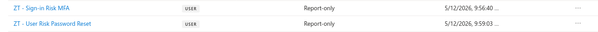

### Zero Trust Test Group
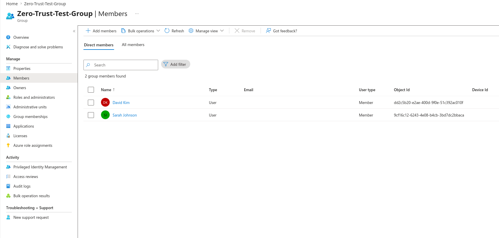

This group is used to safely test policies without impacting all users.

---

## ⚙️ 2. Conditional Access Policy Configuration

### Conditional Access Overview
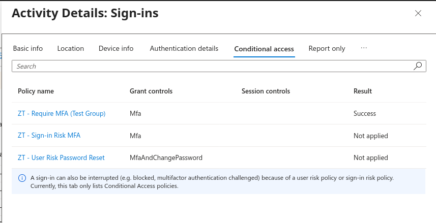

---

### Group Targeting (Scoped Deployment)
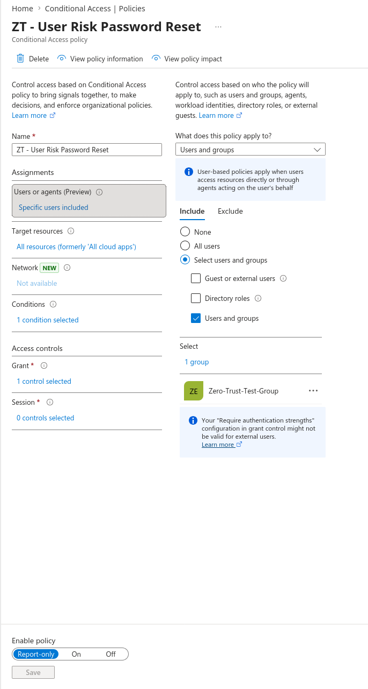

Policies are applied only to a test group to simulate controlled rollout.

---

### Policies Enabled
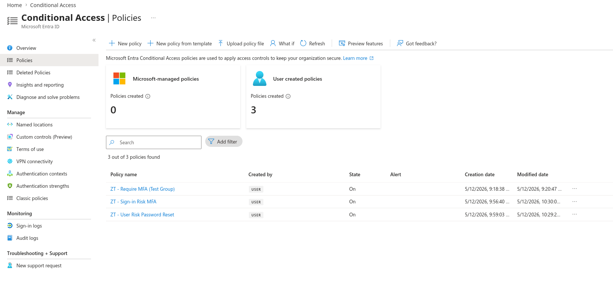

---

## 🛡️ Policy Breakdown

### 🔹 Require MFA Policy
- Applies to: Test group
- Control: Require MFA

---

### 🔹 Sign-in Risk Policy
- Trigger: Medium sign-in risk
- Control: Require MFA

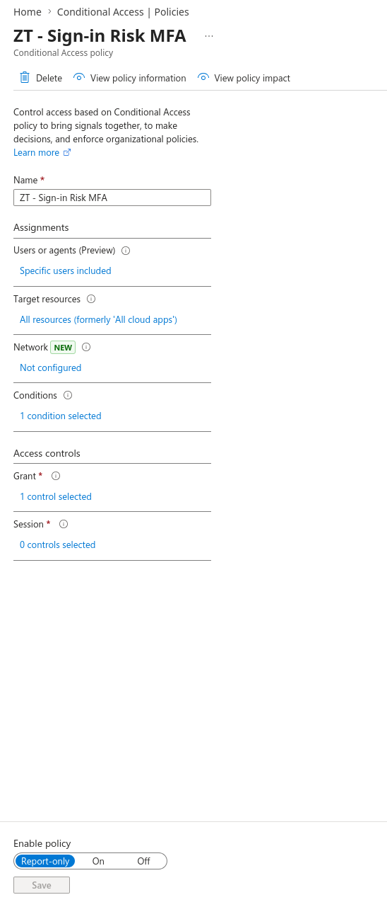
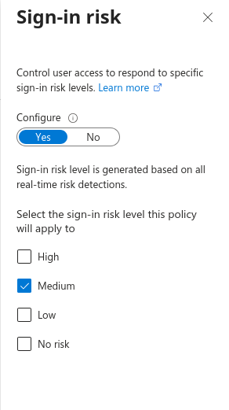
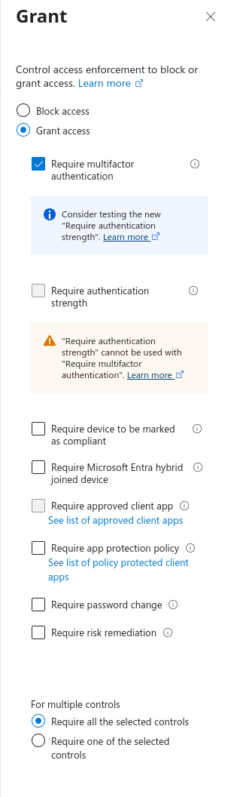

---

### 🔹 User Risk Policy
- Trigger: Medium user risk
- Controls:
  - Require MFA
  - Require password reset

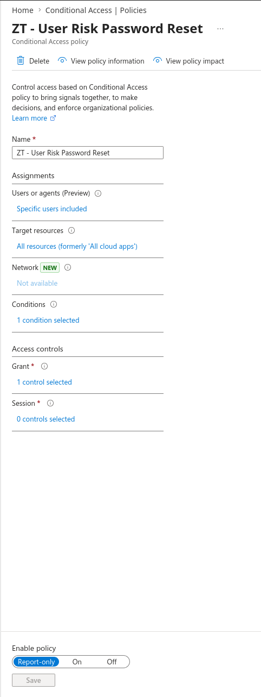
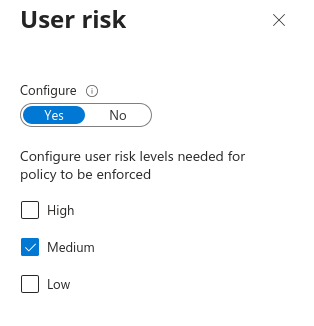
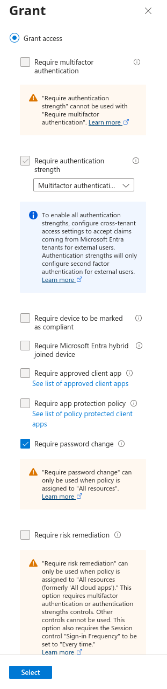

---

## 🔐 3. Policy Enforcement (Real Authentication Flow)

### MFA Challenge Triggered
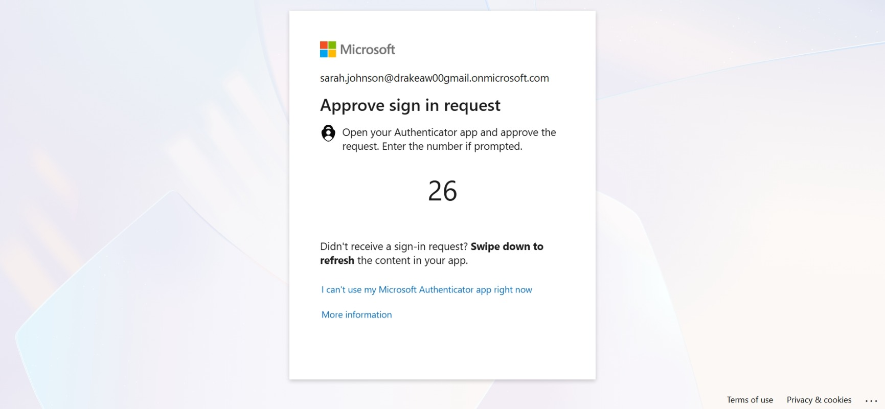

---

### MFA Registration
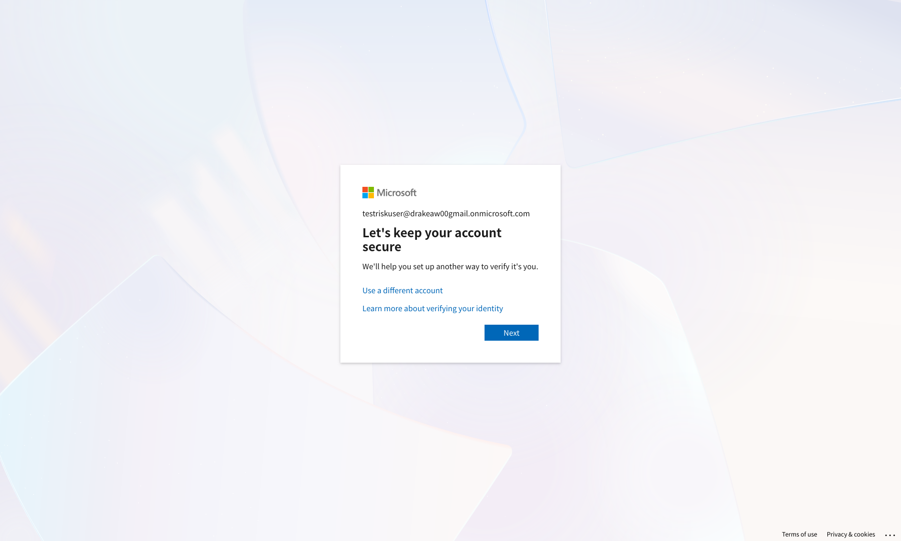

---

### MFA After Authentication
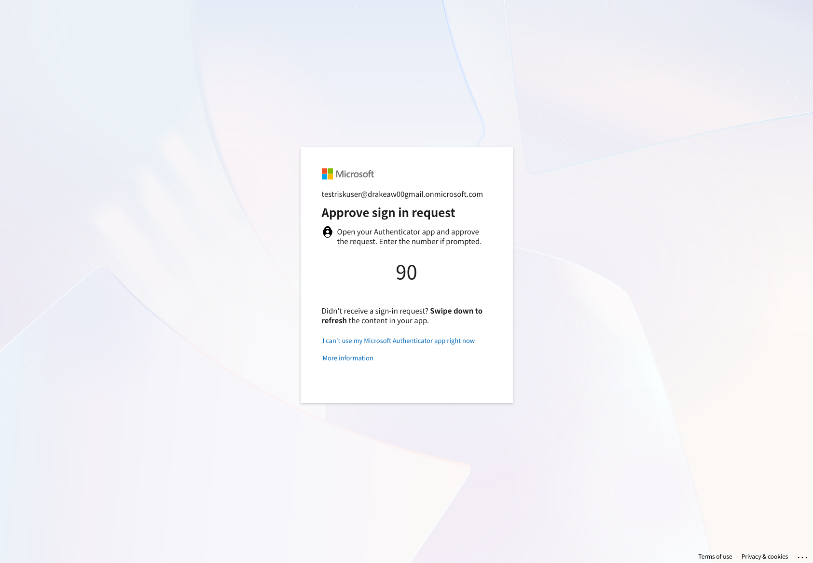

---

### Password Change Enforcement
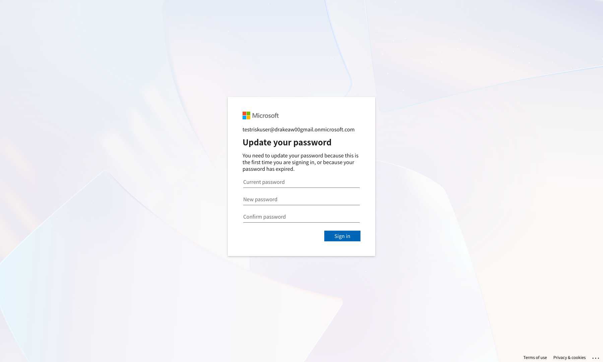

---

### Successful Login
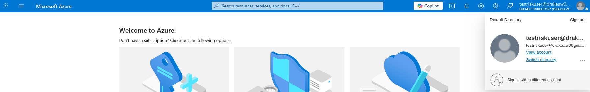

---

## 📊 4. Logging & Policy Validation

### Sign-in Logs
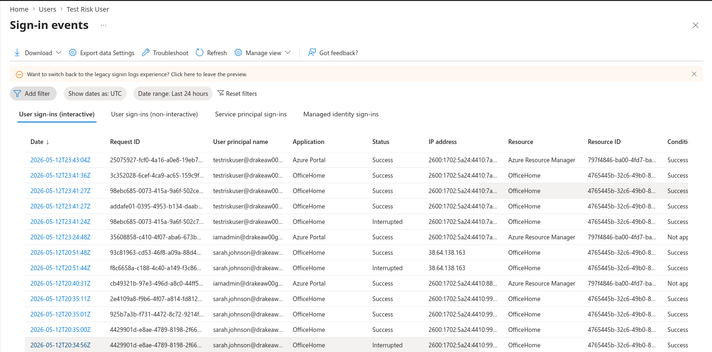

---

### Conditional Access Policy Evaluation
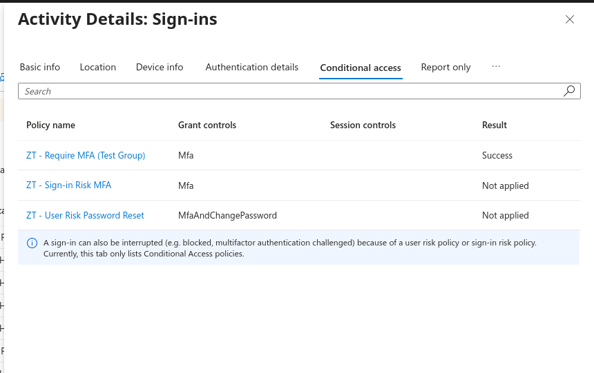

### Observed Results:
- MFA policy → ✅ Applied
- Sign-in Risk policy → ❌ Not applied (no risk detected)
- User Risk policy → ❌ Not applied (no risk detected)

This reflects real-world behavior where policies only apply when risk signals are present.

---

## 🧠 Key Takeaways

- Zero Trust is identity-driven, not network-driven
- Conditional Access policies must be:
  - Scoped
  - Layered
  - Tested before enforcement
- Risk-based policies require real signals to trigger
- Logging is critical to validate security controls

---

## 🚀 Skills Demonstrated

- Microsoft Entra ID (Azure AD)
- Conditional Access
- Identity Protection (User Risk / Sign-in Risk)
- MFA Implementation
- Zero Trust Architecture
- Hybrid Identity (AD + Entra Connect)
- Authentication Flow Analysis
- Security Logging

---

## 📈 Future Improvements

- Named Locations (trusted vs untrusted)
- Device compliance (Intune)
- FIDO2 / passwordless authentication
- Microsoft Sentinel integration

---

## 🧾 Summary

This project demonstrates a real-world implementation of Zero Trust identity security using Microsoft Entra ID.

It includes policy design, enforcement, and validation through real authentication flows and logging analysis.
